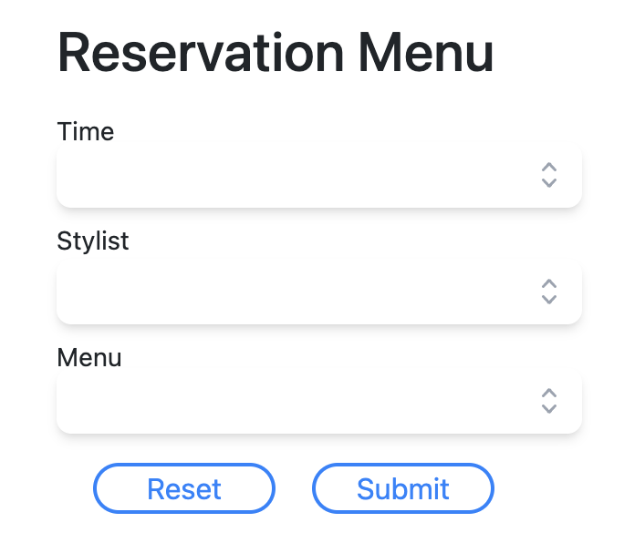
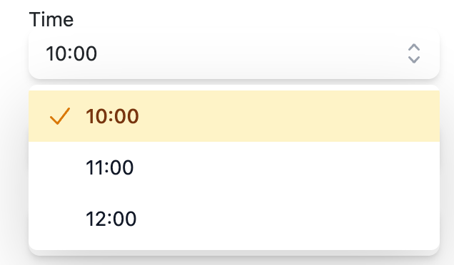

## Nextjs ,TailwindCss, Headless UI

### Headless Ui ListBox Sample is very Beautiful


### Using Component as Headless Ui ListBox




index.tsx
```
interface IForm {
  time: string;
  stylist: string;
  menu: string;
  reset: boolean;
}

const initFormData: IForm = {
  menu: "",
  stylist: "",
  time: "",
  reset: false,
};

export const myfm = createContext({});
....

<myfm.Provider value={value}>
    <div className="m-5">
    .....
    <p className="text-sm mt-2 -mb-1">Stylist</p>
    <MyListBox regiName="stylist" items={["Lisa", "Bob", "Steve"]} />
    ...
</myfm.Provider>
```
MyListBox.tsx
```
interface Props {
  items: any[];
  className?: string;
  regiName: string;
}

export default function MyListBox({ items, className, regiName }: Props) {
  const [selected, setSelected] = useState("");
  const { fmFields, setfmFields }: any = useContext(myfm);

  useEffect(() => {
    setfmFields({
      ...fmFields,
      [regiName]: selected,
      reset: false,
    });
  }, [selected]);

  useEffect(() => {
    if (fmFields.reset) setSelected("");
  }, [fmFields]);

  return ( ....
```

